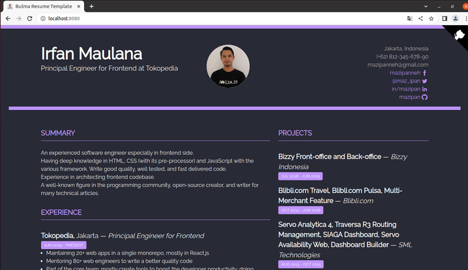

## Reference
- [bulma-resume-template](https://github.com/mazipan/bulma-resume-template)


## Usability Testing
- Prerequisite
  - node/npm : [Install Guide](https://www.whatwant.com/entry/npm)
  - pnpm

```bash
❯ nvm install 14.7.0

❯ nvm use node 14.7.0

❯ npm install -g pnpm
```

- Template Testing

```bash
❯ git clone https://github.com/mazipan/bulma-resume-template.git

❯ cd bulma-resume-template

❯ pnpm install

❯ pnpm run dev
```

- http://localhost:8080/


