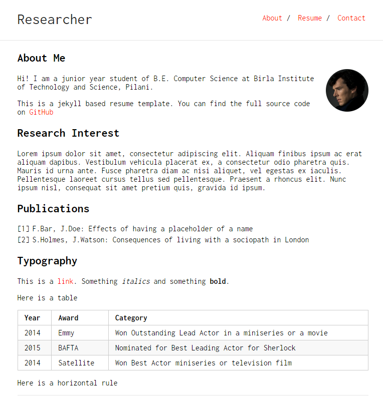
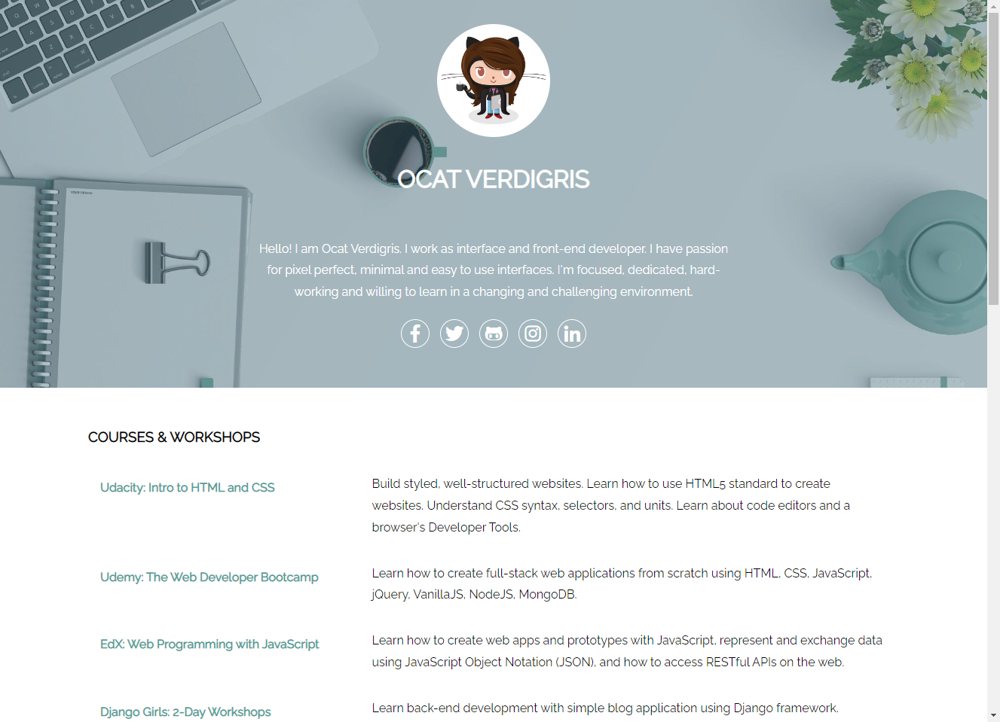
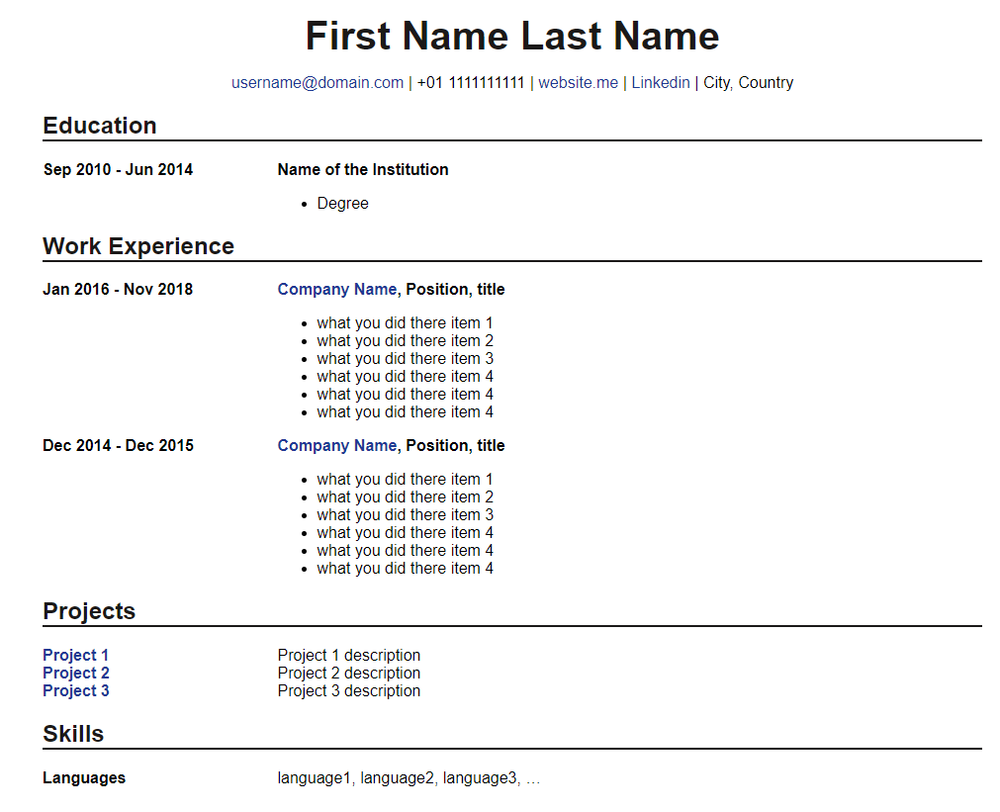

# resume
resume

# Samples

## Gatsby

### [gatsby-starter-resume](https://github.com/anubhavsrivastava/gatsby-starter-resume)

### [gatsby-starter-bee](https://github.com/JaeYeopHan/gatsby-starter-bee)

## Vue

### [Vue Modern Resume](https://github.com/evryn/vue-modern-resume)

### [best-resume-ever](https://github.com/salomonelli/best-resume-ever)

### [Your Awesome Homepage](https://github.com/imfing/vuepress-homepage)

## Bootstrap

### [hugo Resume](https://github.com/eddiewebb/hugo-resume)

### [Orbit](https://github.com/xriley/Orbit-Theme)

### [Dev Resume](https://github.com/xriley/DevResume-Theme)

## jekyll

### [Orbit](https://github.com/sharu725/online-cv)

### [Researcher](https://github.com/ankitsultana/researcher)

### [modern-resume-theme](https://github.com/sproogen/modern-resume-theme)

### [Crisp Minimal Résumé](https://github.com/crispgm/resume)

## Bulma

### [bulma-resume-template](https://github.com/mazipan/bulma-resume-template)

## HTML5

### [HTML5 Résumé Template for Web Developer](https://github.com/daehopark/resume-for-web-developer)

## turborepo

### [Comet-land](https://github.com/hyesungoh/comet-land)

## HTML

### [Oh, So Simple HTML CV!](https://github.com/ritaly/HTML-CSS-CV-demo)

## Markdown

### [Markdown Résumé Template](https://github.com/aonemd/markdown-resume-template)

### [Resume Generator](https://github.com/epsalt/resume-builder)

